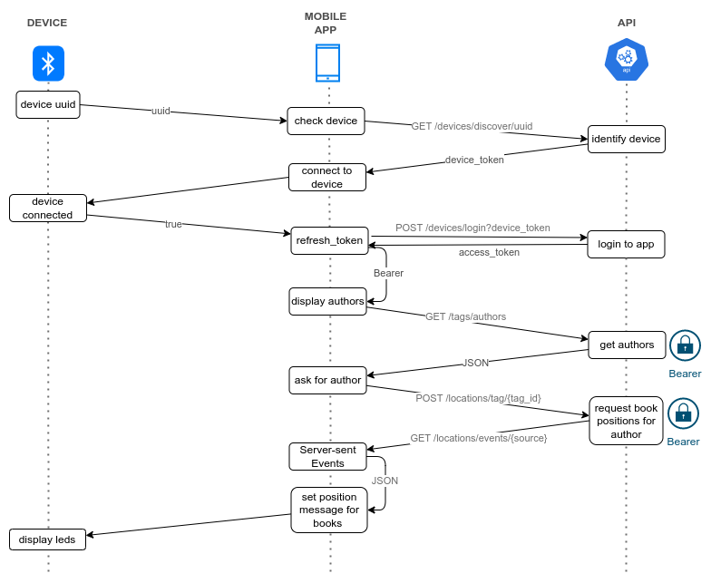

# bibliobus-api
Rest API for [Bibliobus](https://bibliob.us) project

This project use a [FastAPI](https://fastapi.tiangolo.com/) instance

A demo of this API is running at https://api.bibliob.us/docs

## Run instance directly on host

### Install
```
python3 -m venv venv
. venv/bin/activate
pip install fastapi
pip install pydantic-settings
pip install mysql-connector-python
pip install PyJWT
pip install requests
```

### Start instance
```
. venv/bin/activate
uvicorn main:app --reload
```

## Run instance with Docker

Running a bibliobus-api instance with Docker:

### build image : 
```
docker build -t bibliobus-api --build-arg=uid=$(id -u) .
```

### run container 
with your own .env :
```
docker run  --env-file .env --rm -it --user $(id -u):$(id -g) -p 80:8000 -w /app -v `pwd`:/app bibliobus-api 
```

## Sequence diagram for device authentication

Example of a connection sequence on "Bibus" device using Bibliobus Mobile App, followed by the authors list retrieval and a request for books positions for a given author in order to display corresponding leds into bookshelf.

